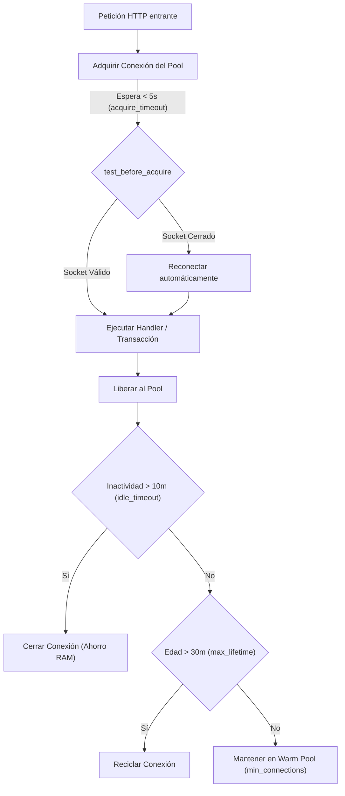

# Gestión de Conexiones SQL y Políticas de ORM en Rust

Este documento detalla la arquitectura de persistencia, las políticas de gobernanza de conexiones SQL y la evaluación del ORM más adecuado para el backend en **Axum + Tokio + PostgreSQL**.

---

## 1. Evaluación Técnica de ORMs en Rust

| ORM / Patrón | Modelo de E/S | Integración con Axum | Ventajas | Desventajas | Veredicto para este Proyecto |
| :--- | :--- | :--- | :--- | :--- | :--- |
| **SeaORM** | 100% Asíncrono (sobre SQLx) | Excelente (Nativo Tokio) | Tipado estricto, ActiveModel, migraciones integradas, relaciones automáticas (1:N, N:M), queries dinámicas seguras. | Mayor tiempo de compilación y mayor complejidad inicial. | **ORM Más Acorde para Proyectos Empresariales y Escalar.** |
| **Diesel** | Sincrónico tradicional (vía `diesel-async`) | Moderada | Extremadamente rápido en CPU, maduro, chequeo en tiempo de compilación. | Complejo de adaptar con Tokio asíncrono; requiere dependencias nativas de libpq de forma rígida. | No recomendado para APIs asíncronas modernas en Axum. |
| **SQLx Entity-Repository (Implementado)** | 100% Asíncrono | Nativo y ligero | Máximo control de transacciones ACID, cero sobrecarga en compilación, entidades con `FromRow`, repositorios desacoplados. | Requiere escribir repositorios manualmente si hay muchas tablas. | **Implementado como Núcleo de Alto Rendimiento y Estabilidad en Docker.** |

---

## 2. Políticas de Gestión del Pool de Conexiones Implementadas

En [`backend/src/db/pool.rs`](file:///d:/PerfilUsuario/Desktop/captador_huellas-master/backend/src/db/pool.rs), la clase `DatabasePoolManager` aplica las siguientes políticas de conexión:



### 2.1 Política de Sizing y Elasticidad (Warm Pool)
- **`max_connections = 20`:** Límite máximo de conexiones concurrentes para evitar agotar la memoria y procesos dedicados del servidor PostgreSQL.
- **`min_connections = 5`:** Pool precalentado (*Warm Pool*). Mantiene siempre 5 conexiones abiertas listas para responder, eliminando el pico de latencia del handshake TLS/TCP en la primera petición de marcaje de la mañana.

### 2.2 Política de Prevención de Bloqueos (Acquire Timeout)
- **`acquire_timeout = 5s`:** Si todas las conexiones están ocupadas bajo un pico masivo de escaneos, el hilo esperará un máximo de 5 segundos antes de retornar un error de sobrecarga, impidiendo que los hilos de Tokio queden colgados indefinidamente.

### 2.3 Política de Higiene y Reciclaje de Sockets
- **`idle_timeout = 10 minutos`:** Si la demanda baja (por ejemplo, en horario nocturno o entre turnos), las conexiones ociosas que excedan `min_connections` se cierran automáticamente para liberar RAM en la base de datos.
- **`max_lifetime = 30 minutos`:** Ninguna conexión vive más de 30 minutos. Se reciclan periódicamente para prevenir problemas de sockets corruptos o conexiones congeladas por timeouts silenciosos de firewalls/NAT.

### 2.4 Política de Validación Preventiva (*Test-on-Borrow*)
- **`test_before_acquire = true`:** Antes de entregar una conexión del pool a un controlador, se valida que el socket TCP con PostgreSQL continúe activo. Si la base de datos se reinició, la conexión muerta se descarta transparentemente y se abre una nueva sin provocar errores `500 Broken Pipe` al usuario.

### 2.5 Política de Resiliencia ante Caídas (Exponential Backoff)
- Si PostgreSQL no está disponible durante el arranque, el backend realiza **hasta 5 intentos de reconexión con retroceso exponencial** (500ms, 1s, 2s, 4s, 8s) antes de abortar.

---

## 3. Arquitectura del ORM: Entidades y Repositorios

El acceso a la base de datos se desacopló completamente de los controladores HTTP mediante el **Patrón Repositorio**:

```text
backend/src/db/
├── pool.rs                       # DatabasePoolManager con las 5 políticas de conexión
├── entities/                     # Modelos ORM fuertemente tipados
│   ├── empleado.rs               # EmpleadoEntity
│   ├── evento_lector.rs          # EventoLectorEntity
│   └── jornada_diaria.rs         # JornadaDiariaEntity
└── repositories/                 # Operaciones de persistencia y consultas SQL
    ├── empleado_repo.rs          # EmpleadoRepository (búsquedas por cédula)
    └── asistencia_repo.rs        # AsistenciaRepository (auditoría, jornadas y transacciones)
```

### Ejemplo de Uso en el Controlador:
```rust
// 1. Consulta limpia mediante la entidad del ORM
let empleado = EmpleadoRepository::buscar_por_cedula(&state.pool, payload.cedula).await?;

// 2. Transacciones ACID atómicas encapsuladas
let mut tx = state.pool.begin().await?;
AsistenciaRepository::insertar_evento(&mut tx, ...).await?;
AsistenciaRepository::registrar_salida_jornada(&mut tx, ...).await?;
tx.commit().await?;
```

---

## 4. Guía de Adopción de SeaORM

Si en el futuro se desea adoptar formalmente **SeaORM**, la transición es directa ya que SeaORM opera sobre el mismo motor SQLx y aprovecha exactamente el mismo pool de conexiones configurado:

### Dependencias en `Cargo.toml`:
```toml
[dependencies]
sea-orm = { version = "1.1", features = ["sqlx-postgres", "runtime-tokio-native-tls", "macros"] }
```

### Configuración del Pool en SeaORM:
```rust
use sea_orm::{ConnectOptions, Database, DatabaseConnection};
use std::time::Duration;

pub async fn connect_sea_orm(config: &Config) -> Result<DatabaseConnection, sea_orm::DbErr> {
    let mut opt = ConnectOptions::new(&config.database_url);
    opt.max_connections(config.db_max_connections)
        .min_connections(config.db_min_connections)
        .connect_timeout(config.db_acquire_timeout)
        .acquire_timeout(config.db_acquire_timeout)
        .idle_timeout(config.db_idle_timeout)
        .max_lifetime(config.db_max_lifetime)
        .sqlx_logging(true);

    Database::connect(opt).await
}
```

### Definición de Entidad en SeaORM:
```rust
use sea_orm::entity::prelude::*;

#[derive(Clone, Debug, PartialEq, DeriveEntityModel)]
#[sea_orm(table_name = "empleados")]
pub struct Model {
    #[sea_orm(primary_key, auto_increment = false)]
    pub cedula: i32,
    pub nombre_completo: String,
    pub departamento: String,
    pub foto_referencial: Option<String>,
    pub template_huella: Option<String>,
    pub activo: bool,
}

#[derive(Copy, Clone, Debug, EnumIter, DeriveRelation)]
pub enum Relation {}

impl ActiveModelBehavior for ActiveModel {}
```
